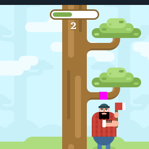

# lumberjack-bot-telegram

## Overview
`lumberjack-bot-telegram` is a Python-based bot designed to automate the process of cutting trees in the Lumberjack game on Telegram. The bot uses image processing to detect branches and keyboard inputs to control the character's actions.

You can play the Lumberjack game on Telegram at [https://t.me/gamebot](https://t.me/gamebot).

## Requirements
The project requires the following Python packages:
- numpy
- Pillow
- opencv-python
- keyboard
- pynput
- screeninfo

You can install the required packages using the following command:
```sh
pip install -r requirements.txt
```

## Usage
1. **Setup**: Ensure you have all the required packages installed.
2. **Run the Bot**: Execute the `main.py` script.
    ```sh
    python main.py
    ```
3. **Mouse Clicks**: The bot will prompt you to click on the positions of the branch above the man's head on the left and right sides of the screen. First, click on the branch above the man's head on the left side (magenta square <span style="display: inline-block; width: 16px; height: 16px; background-color: magenta; margin-right: 5px; vertical-align: middle;"></span>):<br> <br> Then, click on the branch above the man's head on the right side (magenta square <span style="display: inline-block; width: 16px; height: 16px; background-color: magenta; margin-right: 5px; vertical-align: middle;"></span>): <br> <br> These positions are used to detect branches.
4. **Start the Game**: Press and hold the `up` key to start the bot. The bot will begin cutting trees and toggling directions based on the branch positions.
5. **Stop the Bot**: Press the `down` key to stop the bot.

## How It Works
- The bot captures the screen using `ImageGrab` and processes the image using `opencv-python`.
- It listens for mouse clicks to get the coordinates of the man's head on both sides.
- The bot uses keyboard inputs to control the character's actions.
- It continuously checks for branches above the character's head and toggles the direction if a branch is detected.

## License
This project is licensed under the MIT License. See the `LICENSE` file for details.

## Author
Ismayil Mammadov ([7empestGit](https://github.com/7empestGit))

## Acknowledgments
- The project uses several open-source libraries. Thanks to the contributors of `numpy`, `Pillow`, `opencv-python`, `keyboard`, `pynput`, and `screeninfo`.